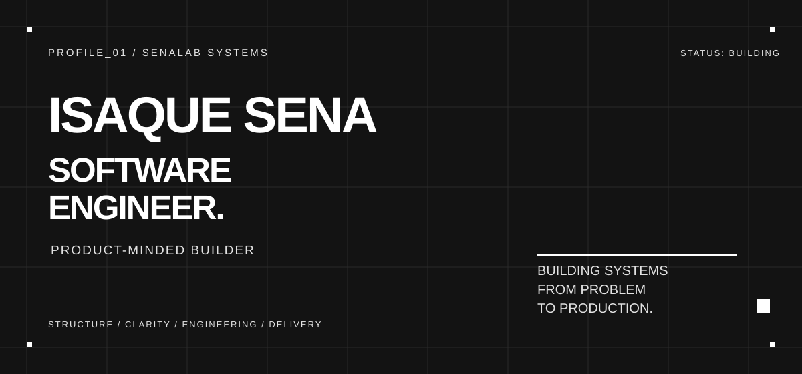
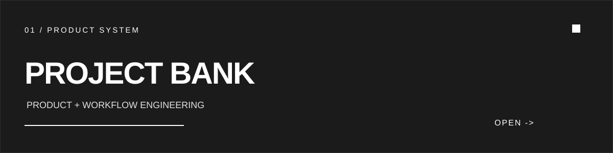
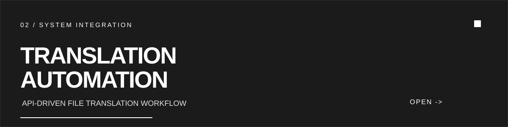

  

  

## 01 / ABOUT

Software Engineer focused on building products, systems, and automations from problem to production.

I work across software development, product, cloud, data, and IoT, with a strong bias toward solving real operational problems.

## 02 / TECHNOLOGIES I'VE WORKED WITH

**LANGUAGES**  
   

**APPLICATION**  
   

**CLOUD & INFRASTRUCTURE**  
    

**AUTOMATION & IOT**  
   

**DATA & OBSERVABILITY**  
    

**TOOLS**  
    

## 03 / CURRENTLY EXPLORING

`AWS` `DISTRIBUTED SYSTEMS` `BACKEND ARCHITECTURE`

## 04 / SELECTED WORK

  
  

### Project Bank

TypeScript product project focused on turning a practical workflow into a usable web experience.

`PRODUCT THINKING` `TYPESCRIPT` `WEB APPLICATIONS` `UX`

[OPEN PROJECT ->](https://project-bank.senalab.cloud/)  
[VIEW SOURCE ->](https://github.com/o-isaque/project-bank)

### PO File Translator

Automates `.po` file translation through LibreTranslate, turning a repetitive process into a repeatable API-driven workflow.

`AUTOMATION` `API INTEGRATION` `PYTHON` `FILE PROCESSING`

[VIEW SOURCE ->](https://github.com/o-isaque/tradutorPython)

## 05 / ACTIVITY

`SYSTEM_ACTIVITY / LAST_365_DAYS`

  

## 06 / CONNECT

[LINKEDIN ->](https://www.linkedin.com/in/isaque-sena/)  
[EMAIL ->](mailto:Isaquesena975@gmail.com)  
[GITHUB ->](https://github.com/o-isaque)

`PROFILE_ID: O-ISAQUE`  
`ROLE: SOFTWARE_ENGINEER`  
`FOCUS: PRODUCT_ENGINEERING`  
`STATUS: BUILDING`
