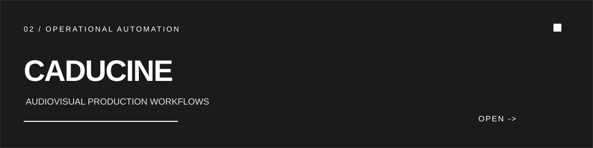
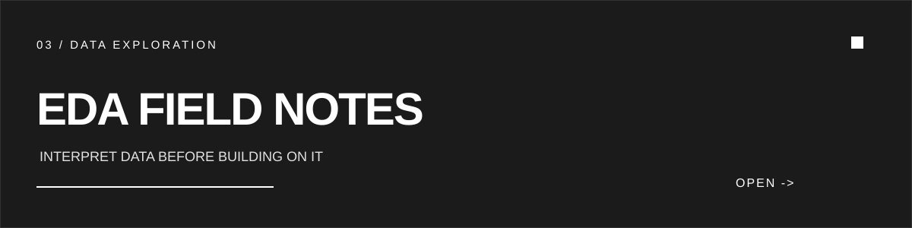

  

## 01 / ABOUT

Software Engineer focused on building useful products end-to-end: from understanding the problem and modeling the domain to implementation, deployment, and iteration.

I work across product, software architecture, backend, frontend, cloud, and automation. My bias is toward clear systems that solve real operational problems.

## 02 / CURRENTLY

`BUILDING_NOW`

- Building product workflows with TypeScript and practical automation.
- Deepening backend engineering, domain modeling, and reliable systems.
- Expanding cloud and distributed-systems practice.

## 03 / FEATURED WORK

**Project Bank** is a TypeScript product project focused on turning a practical workflow into a usable web experience. It represents the product-engineering thread of my work: structure the problem, make the path clear, and ship an interface people can use.

`PRODUCT THINKING` `TYPESCRIPT` `WEB APPLICATIONS` `UX`

[OPEN REPOSITORY ->](https://github.com/o-isaque/project-bank)

 

**CaduCine** is an application for automating operational processes in audiovisual production. The engineering challenge is translating a multi-step real-world operation into dependable workflows with a coherent product surface.

`AUTOMATION` `WORKFLOWS` `TYPESCRIPT` `PRODUCT DELIVERY`

[OPEN REPOSITORY ->](https://github.com/o-isaque/CaduCine)

 

**EDA Field Notes** documents a practical approach to exploring, interpreting, and preparing data before models or dashboards. It is a study in making data work understandable before making it impressive.

`DATA EXPLORATION` `ANALYSIS` `NOTEBOOKLM` `DECISION SUPPORT`

[OPEN REPOSITORY ->](https://github.com/o-isaque/miniguia-estudos-eda)

## 04 / ENGINEERING STACK

**CORE**  
`TYPESCRIPT` `NODE.JS` `REACT` `POSTGRESQL` `DOCKER`

**PLATFORM**  
`GITHUB ACTIONS` `CLOUD` `REST APIS`

**SYSTEMS**  
`DOMAIN MODELING` `AUTOMATION` `WORKFLOWS` `DATA`

## 05 / CONNECT

[GITHUB ->](https://github.com/o-isaque)

`PROFILE_ID: O-ISAQUE`  
`ROLE: SOFTWARE_ENGINEER`  
`FOCUS: PRODUCT_ENGINEERING`  
`STATUS: BUILDING`
